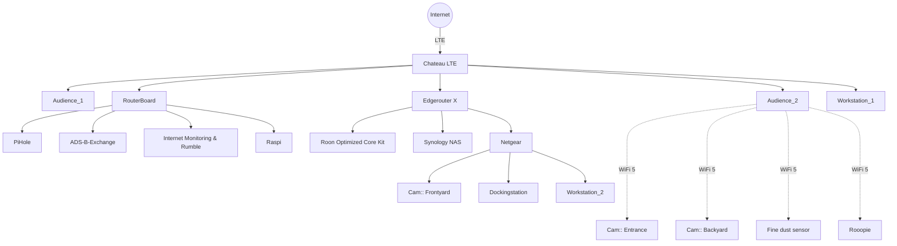

# My home network

This is the place where I keep track of my home network and store stuff like configuration, playbooks, etc.

## Topology

## Setup

Install:

`make install`

Test:

`make test`

Run playbook:

`ansible-playbook main.yml`